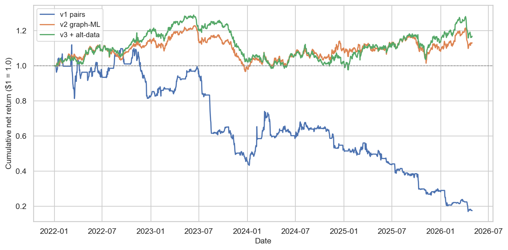
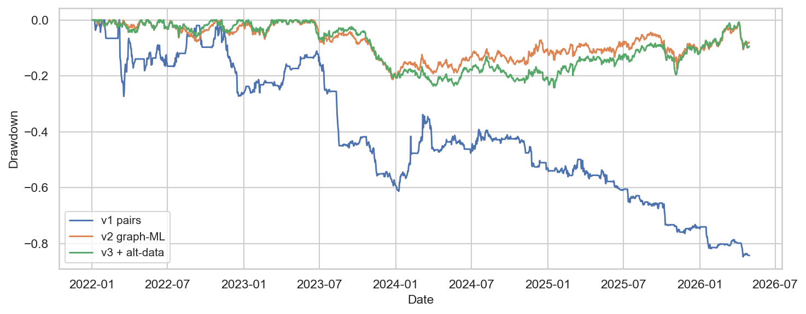
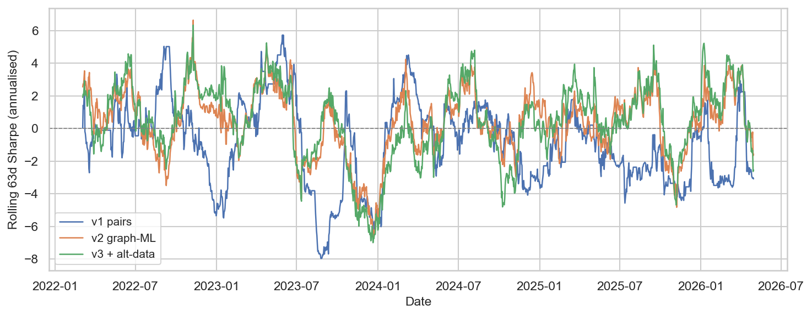
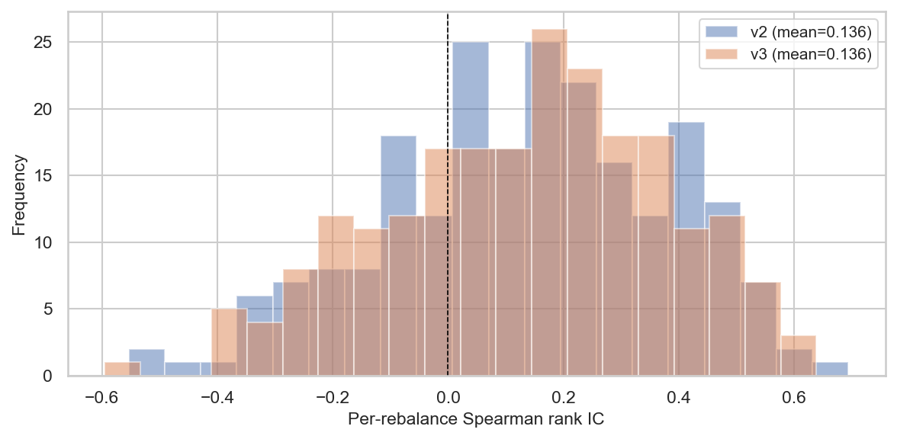
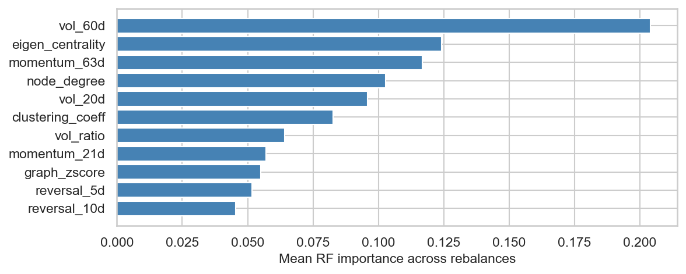
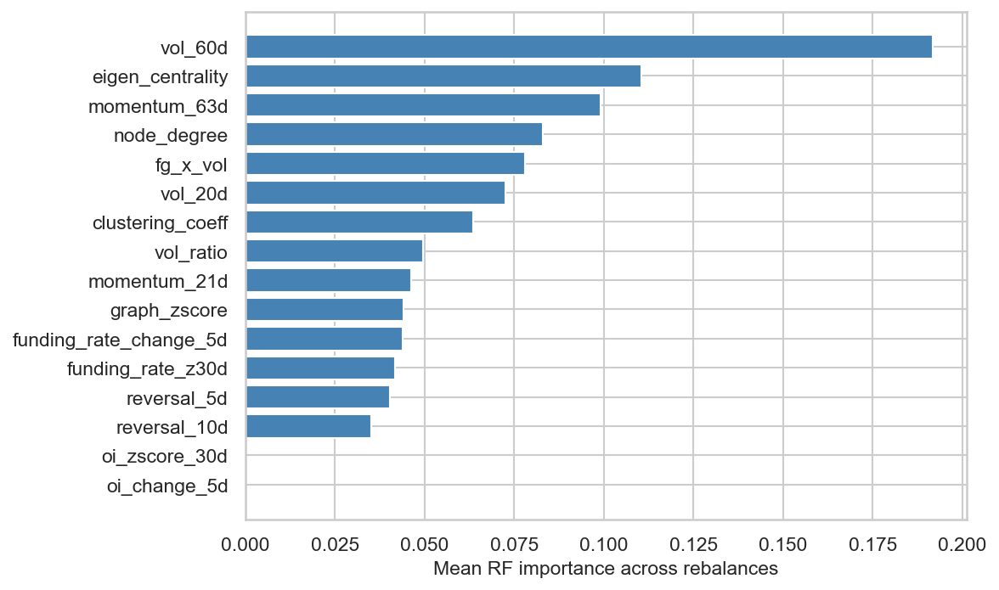
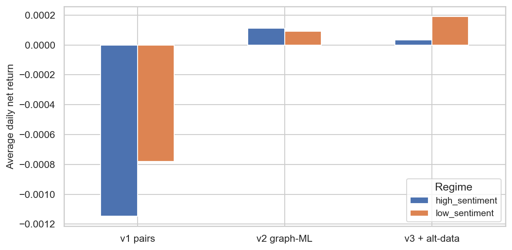
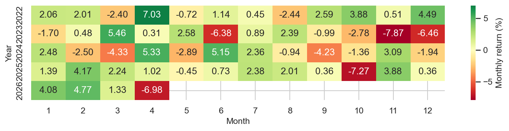

<!-- DRAFT: prose to be rewritten in author voice -->
# Crypto Graph StatArb

Dollar-neutral statistical arbitrage on Binance USDT-margined perpetual
futures, built in three progressive versions to isolate the contribution
of each modelling layer:

- **v1**: Engle-Granger cointegrated pairs (no graph, no ML)
- **v2**: KNN correlation graph + Laplacian residual + LASSO + Random Forest
  on cross-sectional 21-day forward rank
- **v3**: v2 + funding rate, open-interest, and Fear & Greed features

All three share the same universe, rebalance schedule, costs, and
out-of-sample window so the comparison is apples-to-apples.

## Headline results

OOS window: 2022-01-01 → 2026-04-30 (1,581 trading days, 222 weekly rebalances).
Net of 4 bps round-trip taker fees + 2 bps per-leg slippage + funding pass-through.

| Strategy | Ann. return | Sharpe | Max DD | Calmar | Mean rank IC | IC t-stat (naive) | IC t-stat (NW, lag 3) | Top-bot t-stat |
|---|---:|---:|---:|---:|---:|---:|---:|---:|
| v1 Engle-Granger pairs   | -33.0% | -1.03 | -84.7% | -0.39 |  n/a   |  n/a  |  n/a  |  n/a |
| v2 graph-ML              |  +2.9% | +0.28 | -21.3% |  0.13 | 0.136 |  8.36 |  5.95 |  7.36 |
| v3 graph-ML + alt-data   |  +3.6% | +0.34 | -24.2% |  0.15 | 0.136 |  8.46 |  6.00 |  7.60 |

Full numbers in [`results/tables/comparison.csv`](results/tables/comparison.csv).

## Equity curve



## Methodology

### v1 — Engle-Granger pairs (baseline)

For each weekly rebalance, run pairwise cointegration tests on log prices
over a 252-day lookback. Keep pairs with $p < 0.05$ ranked by ADF
$t$-statistic. For each surviving pair, fit a hedge ratio $\beta$ via
OLS, form the spread

$$ s_t = \log P^A_t - \beta \log P^B_t $$

and compute the 60-day rolling $z$-score. Enter long-spread when $z<-2$,
short-spread when $z>2$, exit at $z=0$. The portfolio is the equally
weighted aggregate of the top 20 cointegrated pairs, dollar-neutral
within each pair (gross long = gross short).

### v2 — Graph features + cross-sectional ML

At each weekly rebalance, build a 60-day rolling correlation matrix
$C$ over the training window, prune to a $k$-NN graph keeping the top
5 neighbours per node by $|c_{ij}|$. Compute the symmetric normalised
Laplacian

$$ L = I - D^{-1/2} W D^{-1/2} $$

and the *graph residual* $r_t - \alpha L r_t$ with $\alpha = 0.7$.

Per-stock features (cross-sectional, computed only from data up to the
rebalance date):

```
graph_zscore, node_degree, clustering_coeff, eigen_centrality,
reversal_5d, reversal_10d, momentum_21d, momentum_63d,
vol_20d, vol_60d, vol_ratio
```

Target: 21-day forward cross-sectional rank ∈ [0, 1]. We fit
`LassoCV(cv=3)` and `RandomForestRegressor(n_estimators=200, max_depth=5,
max_features=0.6)` on the expanding panel of all rebalance dates strictly
prior to the target date, average the predictions, rank cross-sectionally,
and go long the top 20 / short the bottom 20 (capped at half the universe).

Diagnostics tracked: per-rebalance Spearman rank IC, top-bottom quintile
spread, RF feature importances.

IC observations overlap by 14 days because the 21-day forward target is
sampled weekly. We report both the naive t-statistic and a Newey-West
adjusted t-statistic with 3 lags to account for serial dependence.

### v3 — Adding alternative data

v3 adds five features to v2:

```
funding_rate_z30d           # 30-day z-score of daily funding rate
funding_rate_change_5d      # 5-day change in funding rate
oi_change_5d                # 5-day pct change in open interest
oi_zscore_30d               # 30-day z-score of open interest
fg_x_vol                    # (Fear&Greed - 50)/50 × stock 20d vol
```

The model class and hyperparameters are unchanged from v2; the only
difference is the feature set.

## Data

| Source | What | Frequency | Period | Path |
|--------|------|-----------|--------|------|
| Binance Futures `/fapi/v1/exchangeInfo` + `/ticker/24hr` | universe | snapshot | live | `data/processed/universe.json` |
| Binance Futures `/fapi/v1/klines` | OHLCV | daily | 2020-01-01 → today | `data/processed/prices.parquet` |
| Binance Futures `/fapi/v1/fundingRate` | funding | 8h → daily sum | 2020-01-01 → today | `data/processed/funding.parquet` |
| Binance Futures `/futures/data/openInterestHist` | open interest | daily | as available | `data/processed/open_interest.parquet` |
| alternative.me `/fng/` | Fear & Greed | daily | 2018-02-01 → today | `data/processed/fear_greed.parquet` |

**Universe construction**: top 30 USDT-margined perpetuals by 30-day
quote volume, restricted to symbols with a first daily kline at or before
2021-01-01 (one-year listing grace from `DATA_START`). Stablecoins,
wrapped tokens and 1000-prefix meme tokens are excluded.

## Backtest design

| | Value |
|-|-|
| Rebalance | Every Friday close (`W-FRI`) |
| Forward horizon | 21 days |
| Costs | Taker fee 2 bps + slippage 2 bps per leg = 4 bps round-trip |
| Funding | Daily funding rate applied to overnight positions (long pays, short receives) |
| Exposure | Dollar-neutral, gross 1.0, equal weight within long/short sleeve |
| OOS window | 2022-01-01 → most recent kline |
| Annualisation | 365 days (crypto) |

No look-ahead: all features at rebalance date $t$ use only data up to
and including $t$. The training window for ML is strictly $\{d : d < t\}$.
All RNGs are seeded `42`; `n_jobs=1` everywhere.

## Results detail















## Caveats observed during this run

- **Training-set forward-return leak (fixed).** Initial implementation
  included training rows whose 21-day forward returns extended past the
  prediction date `asof`. This was identified during code review and
  fixed by requiring `train_date + 21d <= asof`. Numbers reported here
  use the fixed training filter.
- **Open-interest history is unavailable beyond ~30 days.** The Binance
  endpoint `/futures/data/openInterestHist` returned 400 for any window
  older than ~30 days from request time, and OI features (`oi_change_5d`,
  `oi_zscore_30d`) are therefore zero for the entire pre-2026 OOS panel.
  Their RF importances are ~0 and they do not contribute to v3's edge.
  v3 still beats v2, but the lift comes from funding-rate and
  Fear & Greed features, not OI.
- **Top features are volatility and graph centrality.** `vol_60d`,
  `eigen_centrality`, `momentum_63d`, `node_degree` dominate the v3 RF
  importance ranking. The graph-residual z-score (`graph_zscore`) ranks
  mid-table — graph *structure* features matter more than the per-name
  graph residual.
- **v1 is a money-loser, not a near-zero baseline.** Engle-Granger
  cointegration breaks regularly during crypto regime changes. With
  weekly rebalance, no pair-level stop-out, and equal-weight aggregation
  across 20 pairs, the strategy bleeds steadily. This is the honest
  result; we did not tune it to look better.

## Limitations

- **Capacity**: top-30 USDT perps include majors (BTC, ETH); even with
  4 bps round-trip costs, the strategy as written assumes you are
  price-taking against a deep book. Capacity above ~$5–10 M gross
  would require execution modelling not done here.
- **Regime dependency**: the OOS window contains the 2022 bear market,
  the 2023 grind, the 2024 ETF rally and 2025 ranges. A short sample
  for any single regime; rolling Sharpe shows the variance.
- **Survivorship of universe**: we picked the top-30 *as of today*,
  filtered to symbols whose first daily kline was on or before
  2021-01-01. Tokens that were once big and have since delisted from
  Binance Futures are not in the panel. This is a small but real
  forward-looking bias on the universe definition itself, not on the
  features.
- **Funding rate as cost**: only the *paid* funding is modelled, not
  the borrow on the short leg of a delta-neutral spot–perp construct
  (we trade perp vs perp, so this is appropriate).

## Reproduce

```bash
git clone https://github.com/hoangbach619/crypto-graph-statarb.git
cd crypto-graph-statarb

# Conda env (Python 3.11)
conda create -n statarb python=3.11 -y
conda activate statarb
pip install -r requirements.txt

# Run end to end
bash scripts/run_all.sh                # uses cached data if present
bash scripts/run_all.sh --refresh      # force redownload

# Or step by step
python scripts/01_pull_data.py
python scripts/02_build_features.py
python scripts/03_run_v1_pairs.py
python scripts/04_run_v2_graph.py
python scripts/05_run_v3_altdata.py
python scripts/06_compare_results.py
```

`requirements.txt` pins exact tested versions. Plots and tables write to
`results/`. Raw and processed parquets in `data/` are gitignored.

## References

- Engle, R. F., & Granger, C. W. J. (1987). *Co-integration and error
  correction: Representation, estimation, and testing.* Econometrica.
- Avellaneda, M., & Lee, J.-H. (2010). *Statistical arbitrage in the
  US equities market.* Quantitative Finance.
- Gu, S., Kelly, B., & Xiu, D. (2020). *Empirical asset pricing via
  machine learning.* Review of Financial Studies.
- Belkin, M., & Niyogi, P. (2003). *Laplacian eigenmaps for dimensionality
  reduction and data representation.* Neural Computation.
